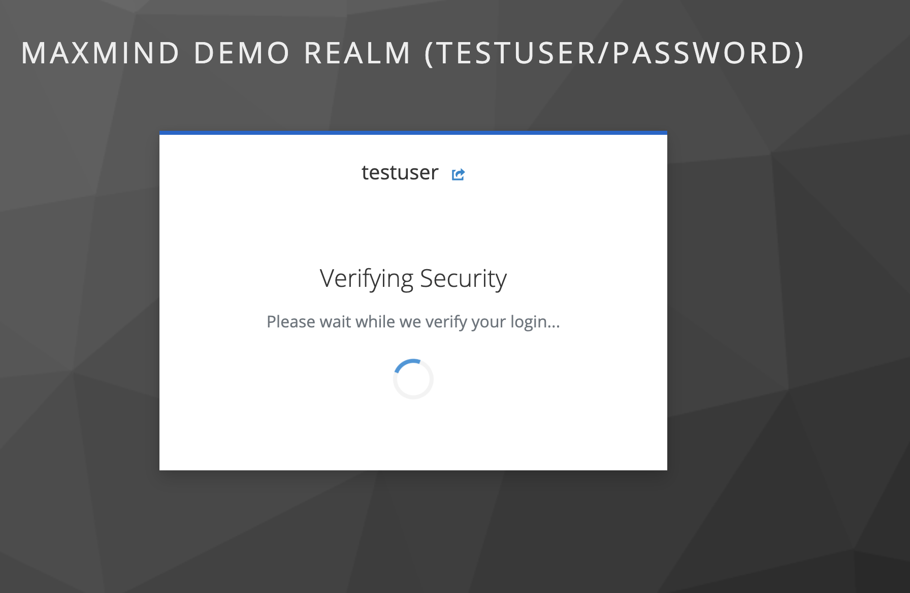
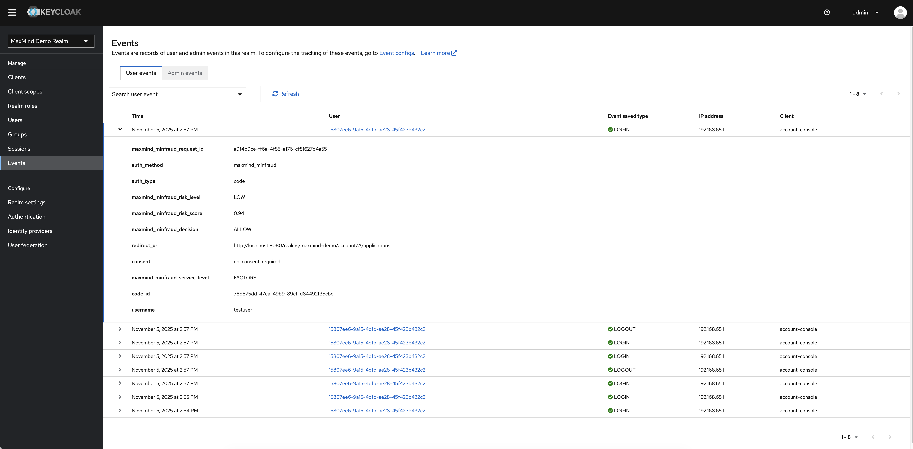
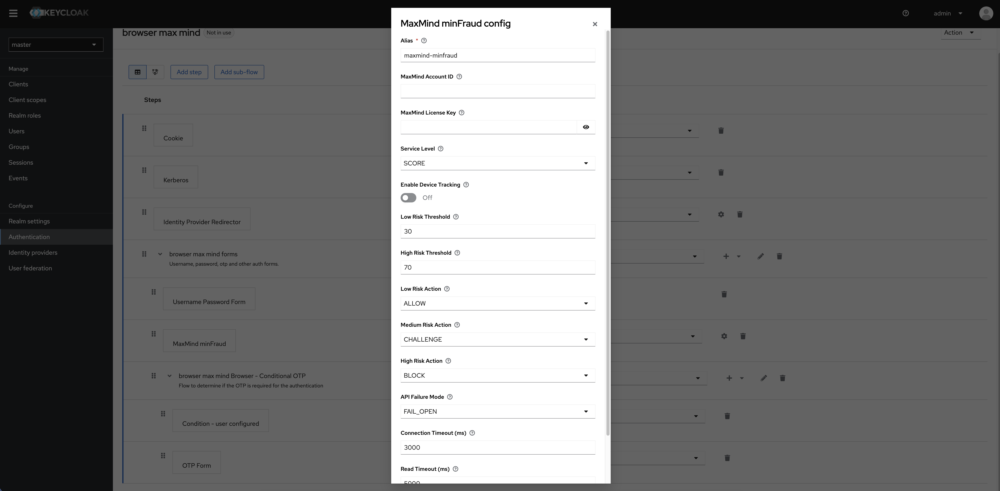

# Keycloak MaxMind minFraud Extension

[](https://github.com/zymlabs/keycloak-maxmind-provider/actions/workflows/ci.yml)
[](https://opensource.org/licenses/Apache-2.0)

A Keycloak authentication extension that integrates MaxMind minFraud fraud detection into the browser login flow. This extension helps protect your application by detecting and responding to potentially fraudulent login attempts in real-time.

## Features

- **Fraud Detection**: Integrate MaxMind minFraud API (Score, Insights, or Factors) into Keycloak authentication
- **Pre-Authentication Mode**: Run fraud checks before username/password entry to block suspicious IPs early
- **IP Allowlist/Blocklist**: Filter authentication by IP address or CIDR ranges with support for IPv4 and IPv6
- **Device Tracking**: Optional MaxMind Device Tracking for enhanced device fingerprinting
- **Risk-Based Actions**: Configurable actions based on risk levels (Allow, Challenge with MFA, or Block)
- **MFA Enforcement**: Block users without MFA during suspicious logins to prevent attackers from setting up OTP during fraud attempts
- **Session Correlation**: Automatically correlate pre-auth fraud checks with user accounts after login
- **Per-Realm Configuration**: Different settings for each Keycloak realm
- **Dual Logging**: Store fraud check results in both database (long-term analytics) and Keycloak events (short-term audit)
- **Event Integration**: Automatic logging to Keycloak's event system for real-time monitoring and compliance
- **Flexible Service Levels**: Start with Score API and upgrade to Insights or Factors as needed
- **Graceful Error Handling**: Configurable fail-open or fail-closed modes for API failures
- **Comprehensive Logging**: Detailed logs for security monitoring and debugging

## Screenshots

### User Experience During Login

*Users see this security verification screen during fraud detection when device tracking is enabled*

### Event Monitoring

*Fraud check events displayed in Keycloak Admin Console with detailed MaxMind risk assessment data including risk score, level, and decision*

### Configuration

*MaxMind minFraud authenticator configuration screen showing all available settings including API credentials, risk thresholds, IP filtering, and actions*

## Prerequisites

- **Keycloak**: Version 22.0.0 or higher (tested up to 26.x)
- **Java**: JDK 17 or higher
- **Database**: PostgreSQL, MySQL, or any Keycloak-supported database
- **MaxMind Account**: Active MaxMind account with minFraud service subscription
  - Sign up at: https://www.maxmind.com/en/solutions/minfraud-services
  - Obtain your Account ID and License Key

### Compatibility Note

This extension (v1.0+) requires **Keycloak 22+** due to the Jakarta EE migration. If you're using Keycloak 17-21, please use version 0.1-SNAPSHOT which targets Keycloak 20.0.5.

## Installation

### 1. Download or Build the Extension

**Option A: Download Pre-built JAR**

Download the latest release from [GitHub Releases](https://github.com/zymlabs/keycloak-maxmind/releases):
- **Stable releases**: `zymlabs-maxmind-provider-{version}.jar` (e.g., `1.0.0`)
- **Development builds**: `zymlabs-maxmind-provider-{version}-alpha.{build}.jar` (from `develop` branch)

**Option B: Build from Source**

```bash
git clone https://github.com/zymlabs/keycloak-maxmind-provider.git
cd keycloak-maxmind-provider
mvn clean package
```

This will create `target/zymlabs-maxmind-provider.jar`

### 2. Deploy to Keycloak

#### For Keycloak Quarkus Distribution (v17+):

```bash
# Copy the JAR to the providers directory
cp target/zymlabs-maxmind-provider.jar /path/to/keycloak/providers/

# Rebuild Keycloak (if needed)
cd /path/to/keycloak
bin/kc.sh build

# Start Keycloak
bin/kc.sh start
```

#### For Keycloak WildFly Distribution (legacy):

```bash
# Copy the JAR to the deployments directory
cp target/zymlabs-maxmind-provider.jar /path/to/keycloak/standalone/deployments/
```

### 3. Verify Installation

Check Keycloak logs for successful deployment:

```
INFO  [com.zymlabs.keycloak.maxmindprovider.MaxMindMinFraudCheckProviderFactory] Initializing MaxMindMinFraudCheckProviderFactory
INFO  [com.zymlabs.keycloak.maxmindprovider.MaxMindMinFraudCheckProviderFactory] MaxMindMinFraudCheckProviderFactory post-initialization complete
```

The database table `maxmind_minfraud_check` should be automatically created via Liquibase.

## Configuration

### 1. Obtain MaxMind Credentials

1. Sign up for a MaxMind account: https://www.maxmind.com/en/geolite2/signup
2. Subscribe to minFraud service: https://www.maxmind.com/en/solutions/minfraud-services
3. Generate a License Key from your account portal
4. Note your Account ID and License Key

### 2. Configure Authentication Flow

1. Log into Keycloak Admin Console
2. Navigate to **Authentication** → **Flows**
3. Create a new flow or copy the existing "Browser" flow
4. Add the **MaxMind minFraud** execution after username/password authentication
5. Set the requirement to **REQUIRED** or **CONDITIONAL**
6. Click the **Actions** (⚙️) button → **Config**

### 3. Authenticator Configuration

Configure the following settings in the MaxMind minFraud authenticator:

| Setting | Description | Default | Required |
|---------|-------------|---------|----------|
| **MaxMind Account ID** | Your MaxMind account ID | - | Yes |
| **MaxMind License Key** | Your MaxMind license key | - | Yes |
| **Service Level** | API service level (SCORE, INSIGHTS, or FACTORS) | SCORE | Yes |
| **Enable Device Tracking** | Enable MaxMind Device Tracking JavaScript | false | No |
| **Record Fraud Checks to Database** | Store fraud check results in database table | true | No |
| **IP Allowlist** | Comma-separated IPs/CIDRs to always allow | Internal/private ranges | No |
| **IP Blocklist** | Comma-separated IPs/CIDRs to always block | (empty) | No |
| **Low Risk Threshold** | Maximum score for low risk (0-100) | 5 | Yes |
| **High Risk Threshold** | Minimum score for high risk (0-100) | 70 | Yes |
| **Low Risk Action** | Action for low risk: ALLOW, CHALLENGE, or BLOCK | ALLOW | Yes |
| **Medium Risk Action** | Action for medium risk | CHALLENGE | Yes |
| **High Risk Action** | Action for high risk | BLOCK | Yes |
| **API Failure Mode** | FAIL_OPEN (allow) or FAIL_CLOSED (block) on API errors | FAIL_OPEN | Yes |
| **Connection Timeout (ms)** | Maximum time to wait for connection establishment | 3000 | No |
| **Read Timeout (ms)** | Maximum time to wait for API response | 5000 | No |

#### Service Levels

- **SCORE**: Returns risk score (0-100) only. Most cost-effective option.
- **INSIGHTS**: Includes risk score + IP geolocation, anonymizer detection, and device tracking.
- **FACTORS**: Most comprehensive - includes everything in Insights plus detailed risk factors.

#### Risk Actions

- **ALLOW**: Allow login to proceed normally
- **CHALLENGE**: Require additional authentication (e.g., OTP/WebAuthn if configured)
- **BLOCK**: Deny login with error message

#### IP Filtering

IP filtering allows you to bypass fraud detection or block authentication based on IP address or CIDR ranges:

- **IP Allowlist**: IPs that always bypass fraud detection (no MaxMind API call)
  - Default includes internal/private ranges: `10.0.0.0/8`, `172.16.0.0/12`, `192.168.0.0/16`, `127.0.0.0/8`, `::1/128`, `fc00::/7`, `fe80::/10`
  - Useful for trusted corporate networks or internal testing
  - Takes precedence over blocklist (prevents lockout if IP is in both lists)

- **IP Blocklist**: IPs that are always blocked before fraud detection
  - Useful for known malicious IPs or geofenced regions
  - Allowlist takes precedence if IP appears in both lists

**Format**: Comma-separated list of IPs/CIDRs. Supports both IPv4 and IPv6.
- Example: `203.0.113.0/24,198.51.100.1,2001:db8::/32`

**Precedence Order**: Allowlist → Blocklist → MaxMind Fraud Check

### 4. Bind the Flow

1. Navigate to **Authentication** → **Bindings**
2. Set your configured flow as the **Browser Flow**

## Usage

### How It Works

1. User attempts to log in with username/password
2. After successful credential validation, the MaxMind authenticator executes:
   - Extracts user IP address, email, username
   - **Checks IP allowlist**: If IP matches, authentication proceeds without MaxMind check
   - **Checks IP blocklist**: If IP matches, authentication is blocked
   - If Device Tracking is enabled, collects device fingerprint
   - Calls MaxMind minFraud API with collected data
3. MaxMind returns a risk score (0-100)
4. Authenticator evaluates risk level:
   - **Low**: Score ≤ Low Risk Threshold
   - **Medium**: Low Risk Threshold < Score ≤ High Risk Threshold
   - **High**: Score > High Risk Threshold
5. Configured action is taken based on risk level
6. Result is stored in database for audit/analytics

### Risk Score Examples

- **0-30**: Legitimate user from known location
- **31-70**: Suspicious indicators (VPN, new device, unusual location)
- **71-100**: High fraud risk (proxy/Tor, known fraudster IP, suspicious email)

### Device Tracking

When enabled, MaxMind Device Tracking adds browser/device fingerprinting:

1. JavaScript is injected into the login page
2. Device session ID is collected client-side
3. Session ID is sent to minFraud API for enhanced fraud detection
4. MaxMind tracks device history across login attempts

### Pre-Authentication Mode (Optional)

The MaxMind authenticator supports running **before** username/password authentication to block suspicious IPs early.

**How it works:**
1. MaxMind check runs before login form (IP-only fraud detection)
2. High-risk IPs are blocked before credential entry
3. After successful login, **Pre-Auth Correlator** updates records with user info
4. Complete audit trail maintained via session-based correlation

**Flow structure:**
```
MaxMind minFraud → Username/Password → Pre-Auth Correlator → MFA Enforcer → OTP
```

**Benefits:**
- Block malicious IPs before they see the login form
- Prevent credential enumeration attacks
- Reduce server load from bot attacks
- Maintain full audit trail with session correlation

**Trade-offs:**
- Less accurate without user email/account data
- Relies primarily on IP reputation and device tracking

**Setup:** Place MaxMind authenticator before username/password in your flow, and add the Pre-Auth Correlator after login for audit trail correlation.

### MFA Enforcement for Suspicious Logins

The **MaxMind MFA Enforcer** authenticator provides an additional security layer when fraud is detected. It prevents attackers from bypassing security by setting up MFA during a fraudulent login attempt.

**How it works:**
- When MaxMind detects medium-risk activity (CHALLENGE action):
  - Users **with** MFA configured → Prompted for MFA verification
  - Users **without** MFA configured → Login blocked with security message

**Supports both modes:**
- Post-auth challenges (after username/password)
- Pre-auth challenges (before username/password, enforced after login)

**Benefits:**
- Prevents attackers from gaining access by simply setting up OTP during fraud attempt
- Encourages proactive MFA adoption
- Provides clear audit trail of blocked attempts

**Setup:** Add the "MaxMind MFA Enforcer" authenticator to your flow between the fraud detector and MFA step (works with both pre-auth and post-auth modes). See [CONFIGURATION.md](docs/CONFIGURATION.md#mfa-enforcer-configuration) for detailed setup and configuration options.

## Querying Fraud Check Results

All fraud checks are stored in the `maxmind_minfraud_check` table (when **Record Fraud Checks to Database** is enabled, which is the default).

**Note**: If database recording is disabled, fraud checks are still logged to Keycloak events but not stored in the database table for long-term querying.

### Example SQL Queries

```sql
-- View recent fraud checks for a user
SELECT timestamp, ip_address, risk_score, decision, device_session_id
FROM maxmind_minfraud_check
WHERE user_id = 'user-uuid-here'
ORDER BY timestamp DESC
LIMIT 10;

-- Find high-risk login attempts in the last 24 hours
SELECT username, email, ip_address, risk_score, decision, timestamp
FROM maxmind_minfraud_check
WHERE realm_id = 'realm-id-here'
  AND timestamp > NOW() - INTERVAL '24 hours'
  AND risk_score >= 70
ORDER BY risk_score DESC;

-- Count logins by decision type
-- Decision types: ALLOW, CHALLENGE, BLOCK, ERROR, IP_ALLOWLIST, IP_BLOCKLIST
SELECT decision, COUNT(*) as count
FROM maxmind_minfraud_check
WHERE realm_id = 'realm-id-here'
  AND timestamp > NOW() - INTERVAL '7 days'
GROUP BY decision;

-- View IPs bypassed by allowlist (no MaxMind API cost)
SELECT ip_address, COUNT(*) as count, MAX(timestamp) as last_seen
FROM maxmind_minfraud_check
WHERE realm_id = 'realm-id-here'
  AND decision = 'IP_ALLOWLIST'
  AND timestamp > NOW() - INTERVAL '7 days'
GROUP BY ip_address
ORDER BY count DESC;

-- View IPs blocked by blocklist
SELECT ip_address, username, email, timestamp
FROM maxmind_minfraud_check
WHERE realm_id = 'realm-id-here'
  AND decision = 'IP_BLOCKLIST'
  AND timestamp > NOW() - INTERVAL '7 days'
ORDER BY timestamp DESC;

-- View full MaxMind API response
SELECT raw_response
FROM maxmind_minfraud_check
WHERE id = 12345;
```

## Viewing Fraud Check Events

In addition to database storage, fraud check results are automatically logged to Keycloak's event system. Events provide real-time audit trails and are useful for compliance and monitoring.

### Enabling Events

1. Navigate to **Realm Settings** → **Events** → **User Events Settings**
2. Enable **Save Events**
3. Set **Expiration** (e.g., 7 days for short-term audit)
4. Optionally add Event Listeners for external monitoring

### Event Details

All fraud checks create user events with the following custom detail keys:

| Event Detail Key | Description | Example Value |
|-----------------|-------------|---------------|
| `maxmind_minfraud_risk_score` | Risk score from MaxMind (0-100) | `45.50` |
| `maxmind_minfraud_risk_level` | Evaluated risk level | `LOW`, `MEDIUM`, `HIGH` |
| `maxmind_minfraud_decision` | Action taken | `ALLOW`, `CHALLENGE`, `BLOCK`, `ERROR`, `IP_ALLOWLIST`, `IP_BLOCKLIST` |
| `maxmind_minfraud_ip_filter` | IP filter result (if applicable) | `ALLOWLIST`, `BLOCKLIST`, `NONE` |
| `maxmind_minfraud_ip_address` | IP address checked | `192.168.1.100` |
| `maxmind_minfraud_request_id` | MaxMind API request ID | `abc123-def456-...` |
| `maxmind_minfraud_service_level` | Service level used | `SCORE`, `INSIGHTS`, `FACTORS` |
| `maxmind_minfraud_action` | Specific action taken | `CHALLENGE`, `BLOCK` |
| `maxmind_minfraud_error` | Error message (if applicable) | `API error: ...` |
| `auth_method` | Authentication method identifier | `maxmind_minfraud` |

### Viewing Events in Admin Console

1. Navigate to **Realm Settings** → **Events** → **User Events**
2. Filter by user, date range, or event type
3. Click on an event to view all details including fraud check information

### Querying Events from Database

Events are stored in the `event_entity` table:

```sql
-- View fraud check events for a user
SELECT time, type, user_id, details
FROM event_entity
WHERE user_id = 'user-uuid-here'
  AND details LIKE '%maxmind_minfraud%'
ORDER BY time DESC
LIMIT 10;

-- Find high-risk events in the last 24 hours
SELECT time, user_id, details
FROM event_entity
WHERE realm_id = 'realm-id-here'
  AND time > EXTRACT(EPOCH FROM NOW() - INTERVAL '24 hours') * 1000
  AND details LIKE '%maxmind_minfraud_risk_level=HIGH%'
ORDER BY time DESC;

-- Correlate events with fraud check records
SELECT
    e.time as event_time,
    e.user_id,
    e.details,
    f.risk_score,
    f.decision,
    f.timestamp as fraud_check_time
FROM event_entity e
JOIN maxmind_minfraud_check f ON e.user_id = f.user_id
WHERE e.details LIKE '%maxmind_minfraud_request_id%'
  AND e.time > EXTRACT(EPOCH FROM NOW() - INTERVAL '7 days') * 1000
ORDER BY e.time DESC;
```

**Note**: Event storage is designed for short-term audit (days to weeks), while the `maxmind_minfraud_check` table provides long-term analytics (months to years). Configure event expiration based on your compliance requirements.

## Development

For detailed development instructions, see [CONTRIBUTING.md](CONTRIBUTING.md).

### Quick Start

#### Requirements

- Docker & Docker Compose
- Maven 3.6+
- Java JDK 17+

#### Local Development Setup

```bash
# Clone the repository
git clone https://github.com/zymlabs/keycloak-maxmind.git
cd keycloak-maxmind

# Build the extension
mvn clean package

# Start Keycloak with Docker Compose
docker-compose up

# Access Keycloak at http://localhost:8080
# Admin credentials: admin / admin
```

The `docker-compose.yml` includes:
- Keycloak 22.0.0
- PostgreSQL database
- Automatic extension deployment to `/opt/bitnami/keycloak/providers/`
- Volume mount for live reload during development

Output: `target/zymlabs-maxmind-provider.jar`

#### Testing

```bash
# Run all unit tests
mvn test

# Run specific test class
mvn test -Dtest=RiskEvaluationTest

# Run with verbose output
mvn test -X
```

**Test Coverage:**
- RiskEvaluationTest (~25 tests): Risk scoring and threshold logic
- MaxMindMinFraudServiceTest (~12 tests): API integration and error handling
- ConfigurationParsingTest (~27 tests): Configuration validation

#### Development Workflow

See [CONTRIBUTING.md](CONTRIBUTING.md) for:
- Branching strategy (GitFlow)
- Commit message conventions
- Release process
- Pull request guidelines

### Project Structure

```
keycloak-maxmind/
├── src/main/java/com/zymlabs/keycloak/maxmindprovider/
│   ├── MaxMindMinFraudAuthenticator.java           # Main authenticator logic
│   ├── MaxMindMinFraudAuthenticatorFactory.java    # Factory with config UI
│   ├── MaxMindMinFraudService.java                 # MaxMind API wrapper
│   ├── MaxMindMinFraudCheckEntity.java             # JPA entity
│   ├── MaxMindMinFraudCheckProvider.java           # Storage provider interface
│   └── MaxMindMinFraudCheckProviderFactory.java    # Storage provider factory
├── src/main/resources/
│   └── META-INF/
│       ├── maxmind-minfraud-changelog.xml          # Liquibase schema
│       └── services/
│           ├── org.keycloak.authentication.AuthenticatorFactory
│           └── org.keycloak.provider.Spi
├── docs/                                            # Extended documentation
├── pom.xml                                          # Maven build configuration
└── README.md                                        # This file
```

## Troubleshooting

### Extension Not Appearing in Admin Console

- Verify JAR is in correct directory (`providers/` or `deployments/`)
- Check Keycloak logs for deployment errors
- Ensure SPI files in `META-INF/services/` are correct
- Try rebuilding Keycloak: `bin/kc.sh build`

### Database Table Not Created

- Check Liquibase logs in Keycloak startup
- Verify database permissions
- Manually check if table exists: `SELECT * FROM maxmind_minfraud_check;`

### MaxMind API Errors

- Verify Account ID and License Key are correct
- Check MaxMind account status and subscription
- Ensure Keycloak server has internet access
- Check for IP allowlist restrictions in MaxMind account
- Review error messages in `error_message` column of stored records

### Device Tracking Not Working

- Verify "Enable Device Tracking" is checked in config
- Check browser console for JavaScript errors
- Ensure `https://device.maxmind.com` is accessible from client browsers
- Device tracking requires JavaScript to be enabled

### High Risk Scores for Legitimate Users

- Review risk thresholds (may need adjustment)
- Check if users are behind VPNs or corporate proxies
- Consider using CHALLENGE instead of BLOCK for medium risk
- Enable INSIGHTS or FACTORS for more accurate detection

### MaxMind API Timeouts

- Default timeouts: 3s connection, 5s read (8s total worst case)
- If users experience slow logins, check error_message column for timeout errors
- Increase timeouts in configuration if MaxMind API is consistently slow from your region
- Consider using FAIL_OPEN mode during development to allow logins on timeout
- Use FAIL_CLOSED mode in production if security is paramount
- Monitor timeout frequency - persistent timeouts may indicate network issues

## Security Considerations

- **License Key Storage**: License keys are stored in Keycloak database. Ensure database is properly secured.
- **Fail Mode**: Use FAIL_CLOSED in production for maximum security, FAIL_OPEN for development.
- **Privacy**: Inform users that IP addresses and email are sent to MaxMind for fraud detection.
- **GDPR Compliance**: Review MaxMind's data processing agreement and your obligations.
- **Rate Limiting**: MaxMind APIs have rate limits. Monitor your usage in MaxMind portal.

## Performance

- **API Latency**: MaxMind typically responds in 50-200ms
- **Timeouts**: Configurable connection (default 3s) and read (default 5s) timeouts prevent users from waiting too long if MaxMind API is slow or unavailable. On timeout, the configured fail mode (FAIL_OPEN/FAIL_CLOSED) determines whether to allow or block the login.
- **Database Impact**: Minimal - one INSERT per login attempt
- **Caching**: Consider implementing caching for repeated IPs if needed
- **Async Option**: Consider making fraud check asynchronous for better UX

## Roadmap

- [ ] Admin UI for viewing fraud check records
- [ ] Customizable email templates for blocked logins
- [ ] Webhook notifications for high-risk events
- [ ] Advanced analytics dashboard
- [ ] Export fraud data for external SIEM integration

## Resources

- [MaxMind minFraud Documentation](https://dev.maxmind.com/minfraud)
- [MaxMind Device Tracking](https://dev.maxmind.com/minfraud/track-devices)
- [Keycloak Authentication SPI](https://www.keycloak.org/docs/latest/server_development/#_auth_spi)
- [Extended Documentation](docs/)

## License

Apache License 2.0

## Contributing

Contributions are welcome! Please see our [Contributing Guide](CONTRIBUTING.md) for details on:

- Development workflow and branching strategy (GitFlow)
- Commit message conventions (Conventional Commits)
- Building, testing, and local development setup
- CI/CD process and automated releases
- Pull request guidelines

Quick links:
- [Report a bug](https://github.com/zymlabs/keycloak-maxmind-provider/issues/new?labels=bug)
- [Request a feature](https://github.com/zymlabs/keycloak-maxmind-provider/issues/new?labels=enhancement)
- [View releases](https://github.com/zymlabs/keycloak-maxmind-provider/releases)

## Support

For issues and questions:
- GitHub Issues: https://github.com/zymlabs/keycloak-maxmind-provider/issues
- MaxMind Support: https://support.maxmind.com

## Credits

Developed by ZymLabs

Based on Keycloak authentication SPI examples and MaxMind minFraud Java SDK.
